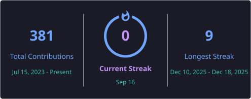

<h1 align="center">Hi 👋, I'm Muhammad Muaz Ahmed</h1>
<h3 align="center">🚀 MERN Stack Developer | 🔐 Cybersecurity Enthusiast | 🌍 Lifelong Learner</h3>

---

  

---

## 💫 About Me:
- ⚡ Skilled in **MERN Stack Development**  
- 🤝 Open to teaming up for MERN Stack projects  
- 🔐 Exploring & mastering **Cybersecurity**  
- 📩 Reach me at: **muhammadmuazahmed@gmail.com**  
- 💙 Love making new connections & collaborations  

---
## 💻 Tech Stack

### 🧩 Programming Languages
      

### 🖥️ Frontend
      

### ⚙️ Backend
  

### 🗄️ Databases
   

### 🔐 Cybersecurity & Pentesting (ethical / authorized testing only)

    
         

### 🛠️ Tools & Platforms
    

### 🎨 Design & Data
  

## 📊 GitHub Stats

  
  

  

---
## 🌐 Let's Connect

  
  
  
  
  
  

